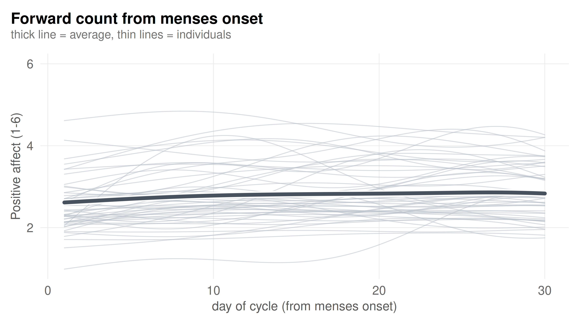
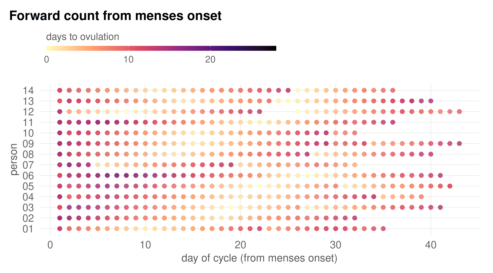
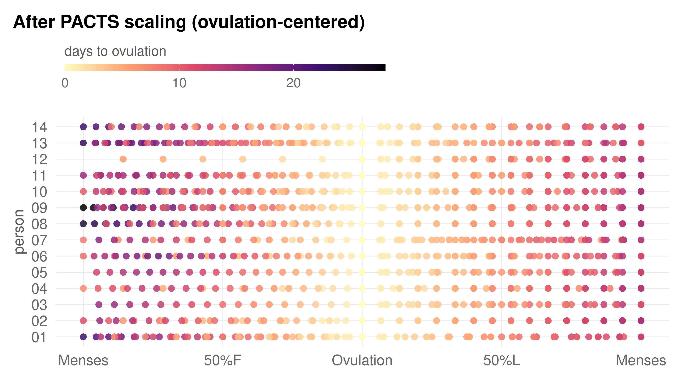
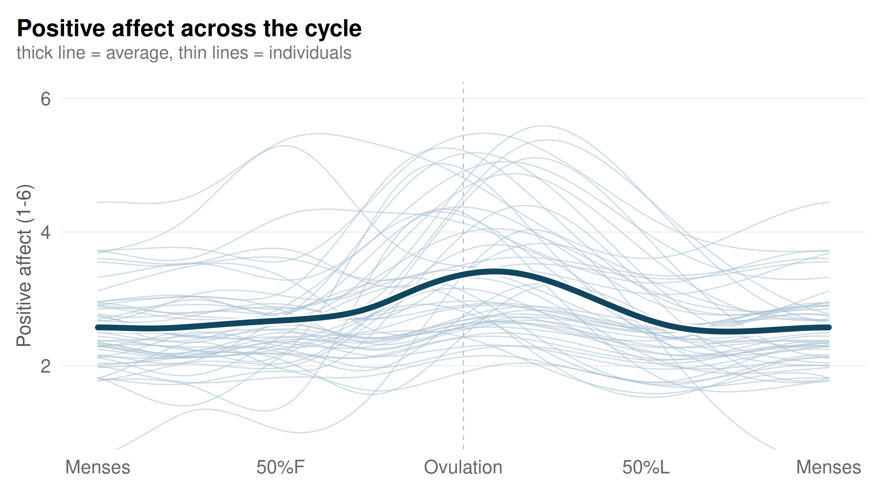

PACTS scaling and cyclic GAMMs
================

**Why the definition of cycle time decides what you find**

*Prepared by Tory Eisenlohr-Moul, PhD, and adapted from the larger
`menstrualcycleR` vignette, [“Getting started with
`menstrualcycleR`”](https://eisenlohrmoullab.github.io/menstrualcycleR/articles/menstrualcycleR-overview.html),
written by Anisha Nagpal, PhD. Claude Code was utilized to polish the
vignette and ensure appropriate length.*

Using synthetic data that mirrors the patterns observed in our own
studies, we’ll ask one question — *does positive affect track the
menstrual cycle?* Once using forward count, then again after PACTS
scaling.

Nothing here depends on outside data; everything is simulated, so it’s
safe to run live on any laptop. Runs end to end in about 15 seconds.

**Method and software.** PACTS is implemented in `menstrualcycleR`
(version 0.1.6 here). Documentation is at
<https://eisenlohrmoullab.github.io/menstrualcycleR/>, and source and
issues at <https://github.com/eisenlohrmoullab/menstrualcycleR>. If you
use it, cite the method paper:

> Nagpal, A., Schmalenberger, K. M., Barone, J. C., Mulligan, E.,
> Stumper, A., Knol, L., Failenschmid, J., Kiesner, J., Peters, J. R., &
> Eisenlohr-Moul, T. A. (2025). Studying the menstrual cycle as a
> continuous variable: Implementing phase-aligned cycle time scaling
> (PACTS) with the `menstrualcycleR` package.
> *Psychoneuroendocrinology*, *181*, 107584.
> <https://doi.org/10.1016/j.psyneuen.2025.107584>

`citation("menstrualcycleR")` returns that entry. The models here are
fitted with `mgcv` (Wood, 2017), which should be cited alongside it.

See that getting-started vignette for the fuller treatment of PACTS, the
cycle-time variables, data requirements, and GAMM specification; this
walkthrough is a condensed, single-question companion to it.

``` r
library(menstrualcycleR)  # pacts_scaling()
library(mgcv)              # the GAMMs
library(ggplot2)           # plots

# Shared figure styling, sized for projection (drop base_size to ~12 for a laptop).
theme_talk <- theme_minimal(base_size = 17) +
  theme(
    plot.title.position = "plot",
    plot.title    = element_text(face = "bold", size = rel(1.00), margin = margin(b = 3)),
    plot.subtitle = element_text(colour = "grey45", size = rel(0.76), margin = margin(b = 14)),
    axis.title    = element_text(colour = "grey35", size = rel(0.82)),
    axis.text     = element_text(colour = "grey40"),
    panel.grid.major = element_line(colour = "grey92", linewidth = 0.35),
    panel.grid.minor = element_blank(),
    legend.title  = element_text(colour = "grey35", size = rel(0.76)),
    legend.text   = element_text(colour = "grey40", size = rel(0.72)),
    plot.margin   = margin(14, 18, 12, 12)
  )

# Step 1 (forward count) is slate; Step 4 (PACTS) is petrol blue.
raw_col   <- "#48525F"; raw_thin   <- "#B9BFC8"
pacts_col <- "#12455F"; pacts_thin <- "#A9C2D4"
```

## Step 0: The input data and its two anchors

Diary data arrives in this shape: one row per person per day, two 0/1
anchor columns, plus whatever else is being tracked. We simulate 50
people over roughly 3 cycles each, measuring `posaff`, a daily
positive-affect rating from 1 to 6.

Those two anchor columns are the **hormonally meaningful anchors**
everything downstream depends on. `menses` marks the *first* day of
menses onset; subsequent bleeding days are 0, and periovulatory spotting
is excluded. `ovtoday` marks the estimated day of ovulation and is coded
by the investigator rather than reported by the participant. Biomarker
confirmation is preferred, by any of the conventions `pacts_scaling()`
documents: the day after the first positive urinary LH test (LH+1), the
day after the BBT nadir (BBT+1), or daily hormone assays.

Confirmation is not required, however. Where a cycle has no confirmed
ovulation, `pacts_scaling()` imputes one at 15 days before the next
menses onset, taking the population-average luteal length, and flags
those days in `ovtoday_impute`. Note that this counts *backward* from
the next onset rather than assuming a mid-cycle ovulation, which is what
makes it defensible: a mid-cycle assumption misclassifies ovulation
badly in cycles with unusually short or long follicular phases.

Positive affect is a useful example because the documented pattern is a
periovulatory peak.

``` r
# (scaffolding -- click "Code" to expand. Nothing here is the lesson; it just
# manufactures a realistic diary so the rest of the document has data to chew on.)
simulate_person <- function(i) {
  cyc_lens <- round(runif(3, 18, 43))  # 3 cycles, cycle length varies a lot person to person

  phenotype <- sample(c("periovulatory", "follicular", "flat"), 1,
                       prob = c(0.55, 0.20, 0.25))
  ov_lag     <- runif(1, -2, 2)     # periovulatory: peak a couple of days either side of ov
  width_days <- runif(1, 2.0, 4.0)  # how sharp the peak is, in days
  amp  <- if (phenotype == "flat") runif(1, 0, 0.3) else runif(1, 1.5, 4.2)  # swing size
  base <- rnorm(1, 2.5, 0.5)        # baseline level

  out <- list()
  menses_date <- as.Date("2024-01-01")
  for (len in cyc_lens) {
    # ovulation timing varies cycle to cycle, so the luteal phase is 9-16 days
    luteal_len <- round(runif(1, 9, 16))
    ov_day <- len - luteal_len + 1
    d      <- seq_len(len)             # day 1 = menses onset
    date   <- menses_date + (d - 1)
    peak_day <- switch(phenotype,
      periovulatory = ov_day + ov_lag,
      follicular    = ov_day - runif(1, 3, 8),   # late follicular, as estradiol climbs
      flat          = ov_day)          # irrelevant, amp is ~0
    posaff <- round(pmin(6, pmax(1,
      base + amp * exp(-(abs(d - peak_day) / width_days)^2) + rnorm(len, 0, 0.3))))
    ovtoday <- as.integer(d == ov_day) * as.integer(runif(1) < 0.7)  # not every cycle yields codeable biomarker data
    out[[length(out) + 1]] <- data.frame(
      id = sprintf("%02d", i), daterated = date,
      menses = as.integer(d == 1), ovtoday = ovtoday, posaff = posaff)
    menses_date <- menses_date + len
  }
  # add a row for the start of the next cycle, so the last cycle has a confirmed end
  out[[length(out) + 1]] <- data.frame(
    id = sprintf("%02d", i), daterated = menses_date, menses = 1L, ovtoday = 0L,
    posaff = round(pmin(6, pmax(1, base + rnorm(1, 0, 0.3)))))
  do.call(rbind, out)
}

set.seed(2026)
raw <- do.call(rbind, lapply(1:50, simulate_person))
rownames(raw) <- NULL
head(raw, 8)
```

    ##   id  daterated menses ovtoday posaff
    ## 1 01 2024-01-01      1       0      2
    ## 2 01 2024-01-02      0       0      3
    ## 3 01 2024-01-03      0       0      3
    ## 4 01 2024-01-04      0       0      3
    ## 5 01 2024-01-05      0       0      3
    ## 6 01 2024-01-06      0       0      3
    ## 7 01 2024-01-07      0       0      3
    ## 8 01 2024-01-08      0       0      3

## Step 1: Fitting a GAMM on forward day count

Stack everyone’s cycles together and count days forward from each menses
onset.

``` r
# (scaffolding) day count forward from THIS cycle's own menses onset (1 = onset),
# resetting each cycle. Needs nothing but the raw dates and the menses flag.
cycle_day_forward <- function(data) {
  out <- rep(NA_real_, nrow(data))
  for (pid in unique(data$id)) {
    idx <- which(data$id == pid)
    d <- data$daterated[idx]
    anchors <- sort(d[data$menses[idx] == 1])
    out[idx] <- vapply(d, function(x) {
      a <- anchors[anchors <= x]
      if (!length(a)) return(NA_real_)
      as.numeric(x - max(a)) + 1
    }, numeric(1))
  }
  out
}

# build a separate frame rather than mutating `raw`, so re-running Step 0 keeps
# showing the diary as it actually arrived
day <- raw
day$cycle_day <- cycle_day_forward(day)
day <- day[!is.na(day$cycle_day) & !is.na(day$posaff), ]
day$id <- factor(day$id)
```

Both anchors are visible in the data. Here is a coded ovulation day,
with the day number it happens to fall on:

``` r
cols  <- c("id", "daterated", "menses", "ovtoday", "cycle_day", "posaff")
i_ov  <- which(day$ovtoday == 1)[1]          # first coded ovulation in the data
day[(i_ov - 1):(i_ov + 1), cols]
```

    ##    id  daterated menses ovtoday cycle_day posaff
    ## 22 01 2024-01-22      0       0        22      5
    ## 23 01 2024-01-23      0       1        23      6
    ## 24 01 2024-01-24      0       0        24      6

And here is the counter restarting at that person’s next menses onset:

``` r
pid  <- as.character(day$id[i_ov])
i_m  <- which(day$id == pid & day$menses == 1 & seq_len(nrow(day)) > i_ov)[1]
day[(i_m - 2):(i_m + 1), cols]
```

    ##    id  daterated menses ovtoday cycle_day posaff
    ## 34 01 2024-02-03      0       0        34      3
    ## 35 01 2024-02-04      0       0        35      3
    ## 36 01 2024-02-05      1       0         1      3
    ## 37 01 2024-02-06      0       0         2      3

Note the day number on which ovulation was coded. It will be a different
number for the next person, and for that person’s next cycle, which is
the point Step 3 returns to.

Now the question everyone actually has:

> **How do I know if my outcome significantly changes across the
> cycle?**

To answer it we turn to **generalized additive mixed models (GAMMs)**
via `mgcv` (Wood, 2017), which let us evaluate whether there are
meaningful, nonlinear changes in an outcome across cycle time while
accounting for repeated measures within individuals. Here that means a
population-level smooth plus a per-person deviation. The formula is
unpacked properly in Step 4; for the moment, the question is simply what
it finds.

``` r
m_daycount <- bam(posaff ~ s(cycle_day, bs = "tp", k = 10) +
                           s(cycle_day, id, bs = "fs", k = 6),
                  data = day, method = "fREML", discrete = TRUE)
```

``` r
# plot only day 1-30: past that only a handful of unusually long cycles still
# contribute, so the estimate there is driven by very few people
grid_day <- seq(1, 30, length.out = 200)
id1 <- levels(day$id)[1]
pop_day <- data.frame(cycle_day = grid_day, id = id1)
pop_day$fit <- predict(m_daycount, pop_day, exclude = "s(cycle_day,id)")  # population only

perid_day <- do.call(rbind, lapply(levels(day$id), function(pid) {
  d <- data.frame(cycle_day = grid_day, id = pid)
  d$fit <- predict(m_daycount, d)
  d
}))

ggplot(pop_day, aes(cycle_day, fit)) +
  geom_line(data = perid_day, aes(group = id), color = raw_thin,
            linewidth = 0.45, alpha = 0.55, lineend = "round") +
  geom_line(linewidth = 3.4, color = "white",   lineend = "round") +
  geom_line(linewidth = 2.0, color = raw_col,   lineend = "round") +
  coord_cartesian(ylim = c(1, 6)) +
  theme_talk +
  labs(x = "day of cycle (from menses onset)", y = "Positive affect (1-6)",
       title = "Forward count from menses onset",
       subtitle = "thick line = average, thin lines = individuals")
```



The population line is flat. On this evidence one would reasonably
conclude that positive affect does not track the cycle, and move on. The
model summary agrees:

``` r
summary(m_daycount)
```

    ## 
    ## Family: gaussian 
    ## Link function: identity 
    ## 
    ## Formula:
    ## posaff ~ s(cycle_day, bs = "tp", k = 10) + s(cycle_day, id, bs = "fs", 
    ##     k = 6)
    ## 
    ## Parametric coefficients:
    ##             Estimate Std. Error t value Pr(>|t|)    
    ## (Intercept)  2.75730    0.09799   28.14   <2e-16 ***
    ## ---
    ## Signif. codes:  0 '***' 0.001 '**' 0.01 '*' 0.05 '.' 0.1 ' ' 1
    ## 
    ## Approximate significance of smooth terms:
    ##                     edf  Ref.df      F p-value    
    ## s(cycle_day)      3.806   4.606  0.646   0.573    
    ## s(cycle_day,id) 199.131 298.000 14.736  <2e-16 ***
    ## ---
    ## Signif. codes:  0 '***' 0.001 '**' 0.01 '*' 0.05 '.' 0.1 ' ' 1
    ## 
    ## R-sq.(adj) =  0.496   Deviance explained = 51.8%
    ## fREML = 5277.7  Scale est. = 0.50015   n = 4632

Three quantities warrant attention.

First, `s(cycle_day)`, the population trend, returns F = 0.65 and p =
.57. Note that it is not the **effective degrees of freedom (EDF)**
telling us this. Smoother fits have lower EDF; more flexible, wiggly
fits have higher EDF. Here the smooth used roughly 3.8 EDF, so it did
fit some wiggle, but none of that wiggle is distinguishable from noise.
`F` is the relevant quantity, not EDF.

Second, `s(cycle_day,id)`, the per-person term, is highly significant.
People clearly differ from one another, which is not the same claim as
people differing cyclically. That distinction is the one this
walkthrough is about.

Third, deviance explained is 51.8%, and essentially all of it comes from
that per-person term. The model performs well by knowing which person an
observation belongs to, rather than where in the cycle it falls.

That conclusion would nonetheless be wrong, and importantly, neither the
outcome, the model, nor the sample size is responsible. The difficulty
lies in the time variable itself, which Steps 2 and 3 take apart.

## Step 2: Rescaling cycle time with `pacts_scaling()`

Linear day-counting methods oversimplify the cycle and introduce
misalignment with the underlying hormonal patterns. They ignore
variation in **follicular versus luteal phase lengths**, which is what
produces reduced power, misclassification, and inconsistent findings
across studies. Concretely: day 14 is mid-follicular in a 34-day cycle
and already premenstrual in an 18-day one, because it is the follicular
phase that varies in length while the luteal phase stays comparatively
constant.

Rather than dividing the cycle into arbitrary phases or counting forward
from menses, PACTS standardizes cycle time as a continuous variable
aligned to **hormonally meaningful anchors**: menses onset and
ovulation. `pacts_scaling()` places every cycle on a common −1 to +1
scale, given an id, a date, and the two anchor columns. It returns both
centerings, and the appropriate one depends on the question:

- `cyclic_time_impute`, menses-centered: 0 = menses, ±1 = ovulation.
- `cyclic_time_imp_ov`, ovulation-centered: 0 = ovulation, ±1 = menses.

To utilize the most observations available to us, we use the imputed
variants: the `imp` in each name denotes that cycles lacking a confirmed
ovulation are still scaled, using the imputed day. Dropping it
(`cyclic_time`, `cyclic_time_ov`) restricts the analysis to
biomarker-confirmed cycles only. Given that positive affect peaks around
ovulation, we take the ovulation-centered version, so that the effect
sits at 0 rather than divided across ±1.

Which of those to report is a real decision rather than a default.
Confirmed-only is more precise per cycle but discards data, and here it
would discard roughly a third of the ovulations:

``` r
scaled <- pacts_scaling(
  raw, id, daterated, menses, ovtoday,
  # The package default is 21-35 days. Widening is appropriate when ovulation is
  # confirmed for most cycles, which it is here; cycles outside the bounds are not
  # scaled. menstrualcycleR separately declines to scale luteal phases outside
  # 7-18 days, following norms from ~600,000 cycles (Bull et al., 2019).
  lower_cyclength_bound = 20, upper_cyclength_bound = 43
)
```

    ## id: id
    ## date: date
    ## menses: menses
    ## ovtoday: ovtoday

``` r
head(scaled[, c("id", "daterated", "menses", "ovtoday", "posaff", "cyclic_time_imp_ov")], 8)
```

    ## # A tibble: 8 x 6
    ##   id    daterated  menses ovtoday posaff cyclic_time_imp_ov
    ##   <chr> <date>      <dbl>   <int>  <dbl>              <dbl>
    ## 1 01    2024-01-01      1       0      2             -1    
    ## 2 01    2024-01-02      0       0      3             -0.955
    ## 3 01    2024-01-03      0       0      3             -0.909
    ## 4 01    2024-01-04      0       0      3             -0.864
    ## 5 01    2024-01-05      0       0      3             -0.818
    ## 6 01    2024-01-06      0       0      3             -0.773
    ## 7 01    2024-01-07      0       0      3             -0.727
    ## 8 01    2024-01-08      0       0      3             -0.682

``` r
# the confirmed-versus-imputed rate, which the package documentation asks be reported
data.frame(
  confirmed = sum(scaled$ovtoday        == 1, na.rm = TRUE),
  imputed   = sum(scaled$ovtoday_impute == 1, na.rm = TRUE),
  pct_confirmed = round(100 * sum(scaled$ovtoday == 1, na.rm = TRUE) /
                        (sum(scaled$ovtoday == 1, na.rm = TRUE) +
                         sum(scaled$ovtoday_impute == 1, na.rm = TRUE)), 1)
)
```

    ##   confirmed imputed pct_confirmed
    ## 1        95      51          65.1

## Step 3: Comparing the two time axes

We colour every observation by its distance to that person’s nearest
ovulation, then plot the same rows twice: first against the day count
from Step 1, then against scaled cycle time. Only the x-axis changes.

``` r
# (scaffolding) distance from each row to the nearest ovulation anchor, plus the
# frames the rest of the document uses.

# days from each row to the nearest anchor day flagged in `anchor_col`
days_to_anchor <- function(data, anchor_col) {
  out <- rep(NA_real_, nrow(data))
  for (pid in unique(data$id)) {
    idx <- which(data$id == pid)
    anchors <- data$daterated[idx][which(data[[anchor_col]][idx] == 1)]
    if (!length(anchors)) next
    out[idx] <- vapply(data$daterated[idx],
                       function(d) min(abs(as.numeric(d - anchors))), numeric(1))
  }
  out
}

# Use the REAL ovulation day where a test confirmed one, and fall back to the
# imputed day only where it's missing. Worth knowing: `ovtoday_impute` flags ONLY
# the days that had to be imputed -- it is not "confirmed + imputed" -- so the two
# columns never overlap and the union is exactly that fallback rule.
scaled$ov_any <- as.integer(scaled$ovtoday == 1 |
                            (!is.na(scaled$ovtoday_impute) & scaled$ovtoday_impute == 1))
scaled$dt_ov     <- days_to_anchor(scaled, "ov_any")
scaled$cycle_day <- cycle_day_forward(scaled)

# rows usable for MODELLING in Step 4: need a cycle position and an outcome
mdl <- scaled[!is.na(scaled$cyclic_time_imp_ov) & !is.na(scaled$posaff) &
              !is.na(scaled$cycle_day), ]
# rows usable for the COLOURED FIGURES below: additionally need an ovulation anchor
# to colour by. Plotting requirement only -- kept separate so it can't quietly
# shrink the modelling sample.
plt <- mdl[!is.na(mdl$dt_ov), ]

# Display only: the two figures below show 14 people for legibility.
# Every model in this document still uses all 50.
plt_fig <- plt[plt$id %in% sort(unique(plt$id))[1:14], ]

dot_style <- list(
  geom_point(size = 2.7, alpha = 0.85, shape = 16),
  scale_color_viridis_c(name = "days to ovulation", option = "magma", direction = -1,
                        guide = guide_colourbar(title.position = "top")),
  theme_talk,
  theme(legend.position = "top",
        legend.justification = "left",
        legend.key.width  = grid::unit(4.2, "lines"),
        legend.key.height = grid::unit(0.45, "lines")))
```

``` r
ggplot(plt_fig, aes(cycle_day, id, color = dt_ov)) + dot_style +
  labs(title = "Forward count from menses onset",
       x = "day of cycle (from menses onset)", y = "person")
```



``` r
ggplot(plt_fig, aes(cyclic_time_imp_ov, id, color = dt_ov)) + dot_style +
  scale_x_continuous(limits = c(-1, 1), breaks = seq(-1, 1, 0.5),
                     labels = c("Menses", "50%F", "Ovulation", "50%L", "Menses")) +
  labs(title = "After PACTS scaling (ovulation-centered)", x = NULL, y = "person")
```



The pale gold points are ovulation. On the Step 1 axis they are
scattered across a 30-day span, because ovulation falls on a different
day number for every person and every cycle. Averaging down any column
of that axis therefore combines ovulatory, menstrual, and mid-luteal
observations, and a real peak cancels itself out. After scaling, those
same points collapse into a single vertical band.

## Step 4: Refitting the same GAMM on PACTS cycle time

The structure is the same as Step 1, now on the cycle-time axis. There
are two smooth terms:

- `s(cyclic_time_imp_ov, bs="cc", k=10)`: the population-level cyclic
  trend. `cc` denotes a **cyclic cubic regression spline**, which
  ensures continuity and cyclicity of the `cyclic_time` variable, and
  therefore **hormonal equivalency at the endpoints of −1/+1**. Cyclic
  smooths designate a natural point at which the covariate space wraps
  around itself; here −1 and +1 both represent menses onset. They are
  automatically penalized, placing a penalty on the wiggliness of the
  fitted curve so that the model captures important trends without
  overfitting noise.
- `s(cyclic_time_imp_ov, id, bs="fs", ...)`: a per-person smooth, giving
  each participant their own trajectory shrunk toward the population
  curve.

The `knots` argument is what specifies −1 and +1 as equivalent.

``` r
mdl$id <- factor(mdl$id)
knots <- list(cyclic_time_imp_ov = c(-1, 1))   # pin the cyclic spline's wraparound at +-1

m <- bam(
  posaff ~ s(cyclic_time_imp_ov, bs = "cc", k = 10) +
           s(cyclic_time_imp_ov, id, bs = "fs", xt = list(bs = "cc"), k = 6),
  data = mdl, method = "fREML", discrete = TRUE, knots = knots)
```

``` r
grid <- seq(-1, 1, length.out = 200)
id_1 <- levels(mdl$id)[1]

pop <- data.frame(cyclic_time_imp_ov = grid, id = id_1)
pop$fit <- predict(m, pop, exclude = "s(cyclic_time_imp_ov,id)")   # population only

perid <- do.call(rbind, lapply(levels(mdl$id), function(pid) {
  d <- data.frame(cyclic_time_imp_ov = grid, id = pid)
  d$fit <- predict(m, d)   # population + this person's own fs deviation
  d
}))

ggplot(pop, aes(cyclic_time_imp_ov, fit)) +
  geom_vline(xintercept = 0, linetype = "dashed", color = "grey75", linewidth = 0.4) +
  geom_line(data = perid, aes(group = id), color = pacts_thin,
            linewidth = 0.45, alpha = 0.55, lineend = "round") +
  geom_line(linewidth = 3.4, color = "white",     lineend = "round") +
  geom_line(linewidth = 2.0, color = pacts_col,   lineend = "round") +
  scale_x_continuous(limits = c(-1, 1), breaks = seq(-1, 1, 0.5),
                     labels = c("Menses", "50%F", "Ovulation", "50%L", "Menses")) +
  coord_cartesian(ylim = c(1, 6)) +
  theme_talk +
  theme(panel.grid.major.x = element_blank()) +
  labs(x = NULL, y = "Positive affect (1-6)",
       title = "Positive affect across the cycle",
       subtitle = "thick line = average, thin lines = individuals")
```



The same people, the same outcome, and the same model structure now
produce a clear periovulatory peak that tapers through the luteal phase.
Only the time variable changed.

``` r
summary(m)
```

    ## 
    ## Family: gaussian 
    ## Link function: identity 
    ## 
    ## Formula:
    ## posaff ~ s(cyclic_time_imp_ov, bs = "cc", k = 10) + s(cyclic_time_imp_ov, 
    ##     id, bs = "fs", xt = list(bs = "cc"), k = 6)
    ## 
    ## Parametric coefficients:
    ##             Estimate Std. Error t value Pr(>|t|)    
    ## (Intercept)  2.79133    0.09386   29.74   <2e-16 ***
    ## ---
    ## Signif. codes:  0 '***' 0.001 '**' 0.01 '*' 0.05 '.' 0.1 ' ' 1
    ## 
    ## Approximate significance of smooth terms:
    ##                              edf Ref.df     F p-value    
    ## s(cyclic_time_imp_ov)      6.449      8 18.57  <2e-16 ***
    ## s(cyclic_time_imp_ov,id) 218.374    249 30.33  <2e-16 ***
    ## ---
    ## Signif. codes:  0 '***' 0.001 '**' 0.01 '*' 0.05 '.' 0.1 ' ' 1
    ## 
    ## R-sq.(adj) =  0.696   Deviance explained = 71.4%
    ## fREML = 3595.8  Scale est. = 0.30374   n = 3860

Placed alongside the Step 1 summary, three comparisons stand out. First,
`s(cyclic_time_imp_ov)` moves from F = 0.65 to F = 18.6, and from p =
.57 to p \< 2e-16. Second, `s(cyclic_time_imp_ov,id)` remains highly
significant, exactly as before: people still differ from one another,
and what has changed is that the population term now has something to
say as well. Third, deviance explained rises from 51.8% to 71.4%, with
adjusted R² moving from 0.50 to 0.70, indicating that cycle position is
capturing variance the day-count axis had no way to reach.

Two features of the figure warrant comment. The average recovers the
documented pattern. The individual curves show that the average is not
the whole story: those who peak vary considerably in amplitude and
sharpness, some peak earlier in the late follicular phase, and some are
flat. Taken together, the average establishes that the effect is real,
while the spread indicates whom it actually describes.

Two points of fairness, since both are obvious objections. First, Step 1
used every row (4632), whereas this model uses the 3860 rows PACTS was
able to scale. Refitting the day-count model on exactly those 3860 rows
still returns F = 0.70, p = .56, and deviance explained of 53.5%,
against 71.4% here. The axis is doing the work, not the sample.

Second, the basis differs as well: Step 1 used `bs="tp"` and this model
uses `bs="cc"`. That is not a confound one could design away, because a
forward day count is not cyclic. Day 1 and day 43 are different cycle
positions, not the same moment, so there is nothing to wrap and a cyclic
basis would be wrong there. The basis follows from the axis rather than
varying independently of it.

------------------------------------------------------------------------

### What the comparison shows

Misalignment did not produce a visibly wrong answer, which one would
know to distrust. It produced a clean and plausible null. Importantly,
additional participants would not have corrected it, given that
misalignment introduces bias rather than noise; a larger sample would
simply estimate the smeared curve more precisely.

### Using your own data

The same steps apply with your own columns substituted: `id`, `date`,
`menses`, `ovtoday`, and your outcome in place of `posaff`. Use
`cyclic_time_imp_ov` for ovulation-anchored questions of this kind, or
`cyclic_time_impute` for menses-anchored ones such as premenstrual
symptoms. For data requirements, ovulation coding, and the full GAMM
treatment, see [Getting started with
`menstrualcycleR`](https://eisenlohrmoullab.github.io/menstrualcycleR/articles/menstrualcycleR-overview.html).

`bam(method="fREML", discrete=TRUE)` is used throughout for speed at
scale. The standard call, `gam(method="REML")`, uses the same formula
and returns the same answer, but scales considerably worse once there
are hundreds of people.
